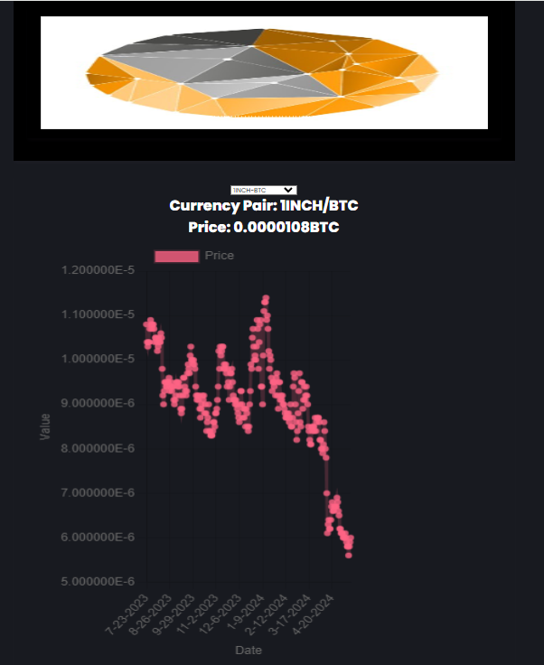
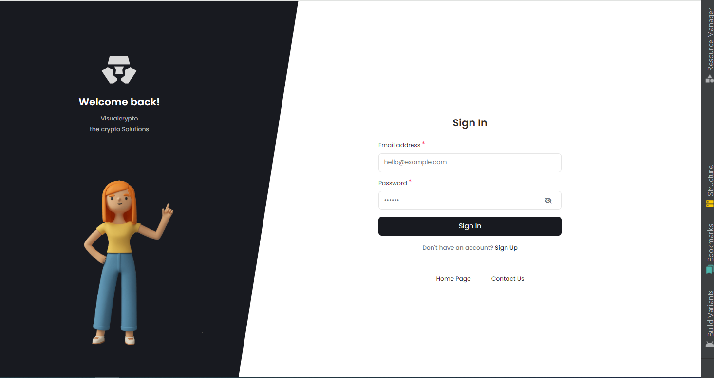
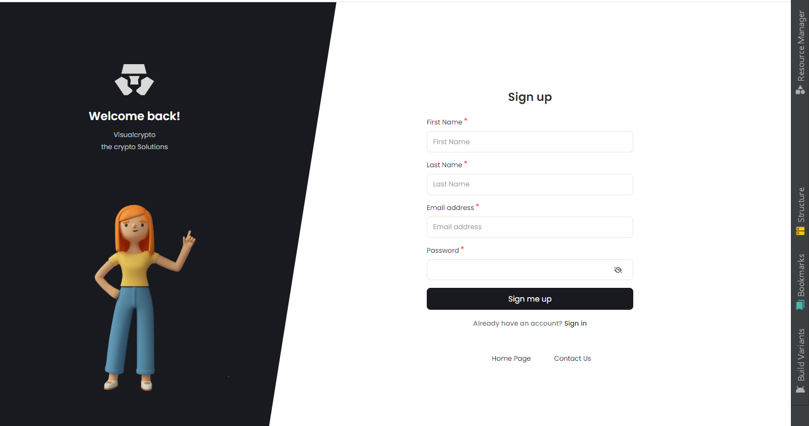
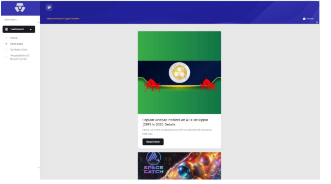
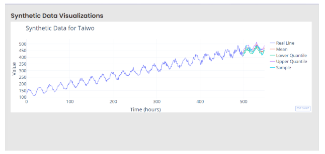
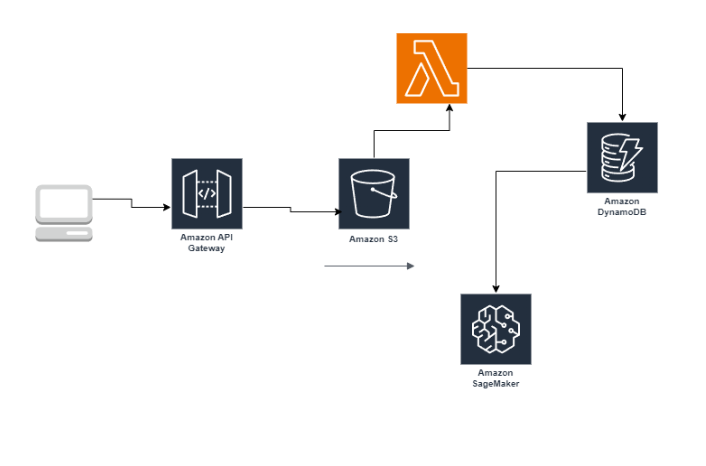

# Table of Contents

1. [Introduction](#introduction)
2. [Frontend Screenshots](#frontend-screenshots)
3. [Data Visualization Screenshots](#data-visualization-screenshots)
4. [Architecture Diagram](#architecture-diagram)
5. [Description of Cryptocurrency Exchange Website](#description-of-cryptocurrency-exchange-website)
6. [Running the Application](#running-the-application)
7. [Conclusion](#conclusion)


## Introduction

This project aims to develop a cryptocurrency exchange website that incorporates machine learning for sentiment analysis and utilizes serverless architecture with AWS Lambda functions. The website also provides users the ability to register with the platform while offering insights into market sentiments through data visualization.

## Frontend Screenshots

The following are screenshots of the frontend interface showcasing the trading platform, user dashboard, and other relevant features.
### Home Page


### Login Page


### Signup Page


### Newspage in the users dashbaord Page



## Data Visualization Screenshots
The followings are screenshots of data visualizations demonstrating the effectiveness of the prediction model with synthetic data.
### Synthetic Analysis in the users dashbaord Page


## Architecture Diagram
Below is the provide a detailed architecture diagram illustrating the relationships between Lambda functions, API Gateway, database, frontend, and other components. 
### Architecture Diagram image


## Description of Cryptocurrency Exchange Website
The cryptocurrency exchange website is designed to provide users with a seamless trading experience while incorporating machine learning for sentiment analysis. Key components and functionalities include:

- **Frontend Interface**: Developed using modern web technologies, the frontend interface offers users intuitive access to trading features, market data, and user account management.

- **Machine Learning for Sentiment Analysis**: Utilizes natural language processing (NLP) techniques to analyze sentiments from various sources such as social media, news articles, and forums. The sentiment analysis model provides insights into market trends and user sentiments, aiding traders in decision-making.

- **AWS Lambda Functions**: Implements serverless computing for trade execution, data processing, and scheduled tasks. Lambda functions ensure scalability, cost-efficiency, and low-latency response times.

- **Database**: Utilizes a scalable and reliable database (e.g., Amazon DynamoDB) to store user data, transaction history, sentiment analysis results.


## Running the Application
1. Navigate to the directory containing the frontend of the website by using the `cd` command:

    ```bash
    cd "Frontend of website"
    ```

2. Launch the `index.html` file in a web browser:

    - Open your preferred web browser.
    - Navigate to the file menu or address bar.
    - Enter the path to the `index.html` file or drag and drop the file into the browser window.
    - Press Enter to load the webpage.


## Conclusion
The cryptocurrency exchange website integrates cutting-edge technologies to deliver a robust and feature-rich trading platform. By leveraging machine learning for sentiment analysis, serverless architecture with AWS Lambda functions, and a scalable database, the platform empowers users with valuable insights and seamless trading experiences.


#THANKS YOU!!!


